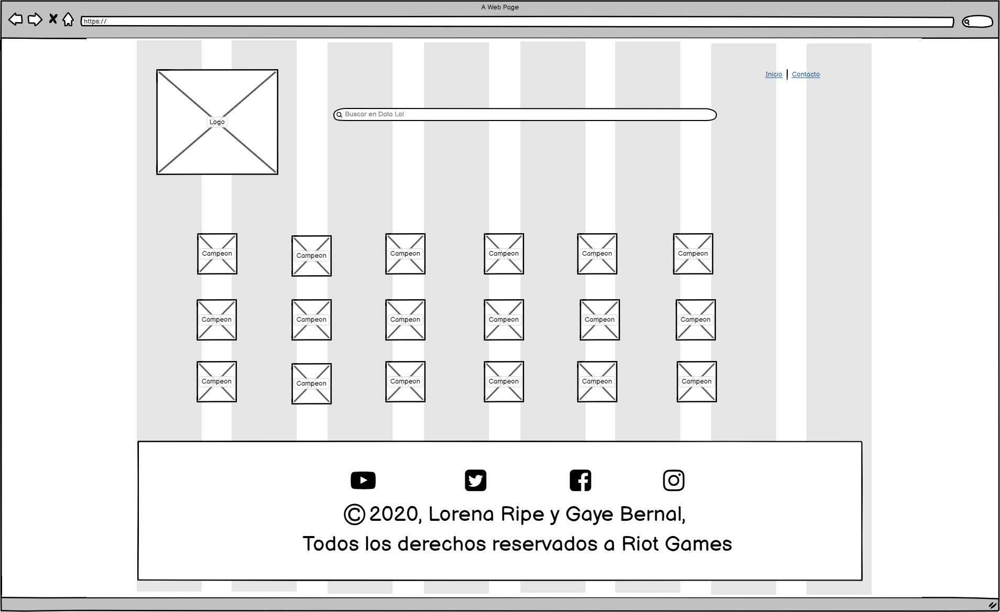

# Data Lol
​
## Índice
​
- [Data Lol](#data-lol)
  - [Índice](#índice)
  - [1. Preámbulo](#1-preámbulo)
  - [2. Resumen del desarrollo del proyecto](#2-resumen-del-desarrollo-del-proyecto)
  - [3. Carpetas que encontrarás en el repositorio](#3-carpetas-que-encontrarás-en-el-repositorio)
  - [SRC](#src)
    - [DATA](#data)
    - [Test](#test)
    - [README](#readme)
    - [Recursos visuales](#recursos-visuales)
  - [4. Look final del proyecto vista de ordenador](#4-look-final-del-proyecto-vista-de-ordenador)
  - [4. Look final del proyecto vista de móvil](#4-look-final-del-proyecto-vista-de-móvil)
  - [5. Investigación UX](#5-investigación-ux)
    - [Sketch inicial](#sketch-inicial)
    - [Sketch inicial mobile](#sketch-inicial-mobile)
    - [Imagen del prototipo final](#imagen-del-prototipo-final)
  - [5. Planning del proyecto](#5-planning-del-proyecto)
  - [6. Objetivos de aprendizaje](#6-objetivos-de-aprendizaje)
    - [UX](#ux)
    - [HTML y CSS](#html-y-css)
    - [DOM](#dom)
    - [Javascript](#javascript)
    - [Testing](#testing)
    - [Git y GitHub](#git-y-github)
    - [Buenas prácticas de desarrollo,](#buenas-prácticas-de-desarrollo)
​
## 1. Preámbulo
​
Este es el segundo proyecto que desarrollamos en el Bootcamp de [Laboratoria], propusimos una pagina donde mostrara la informacion acerca del juego [League of Legends - Challenger leaderboard](src/data/lol/lol.json), el objetivo principal de este proyecto fue visualizar la data filtrarla, ordenarla y se agrego una barra de busqueda donde muestra cada campeon por nombre.
​
## 2. Resumen del desarrollo del proyecto
​
Tras leer el [README] hicimos un sketch de baja fidelildad en balsamiq y un sketch de alta fidelidad en Figma, dónde se llevó a cabo una sesión de feedback todos los martes en cada sprint donde tuvimos la oportunidad de hacer mejoras prontas al prototipo de alta fidelidad.
Luego, forkeamos el proyecto base, lo desarrollamos localmente, desarrollamos la estructura básica en html, luego nos enfocamos en JavaScript mientras generabamos recursos visuales e interactuábamos con CSS y asi mismo nos enfocamos en manipular las funciones para testearlas.
​
## 3. Carpetas que encontrarás en el repositorio

## SRC

### DATA

 | Archivo     | Descripción                   |
 | :---------- | :---------------------------- |
 |   lol.js    |  Data del juego               |
 |   lol.json  | Data del juego ver JSON       |
 |  README.md  | Resumen del juego y campeones |

 | Archivo     | Descripción                   |
 | :---------- | :---------------------------- |
 | index.html  | Página principal  |
 |  main.js    | Interacción con el DOM        |
 | data.js| Manipulación de datos a través de arreglos y objetos|
 | style.css| Estlos del proyecto global|
​
​

### Test
| Archivo     | Descripción                   |
 | :---------- | :---------------------------- |
 | data.spec.js  | Test  unitarios de las funciones implementadas en el archivo data.js |
​

​
### README
​
| Archivo   | Descripción                                                 |
| :-------- | :---------------------------------------------------------- |
| readme.md | Información general del proyecto y objetivos de aprendizaje |
​
​
### Recursos visuales
​
| Carpeta  | Descripción                                                     |
| :------- | :-------------------------------------------------------------- |
| sketch | Carpeta con los skecth de alta y baja fidelidad |
​
## 4. Look final del proyecto vista de ordenador
​

​

​

​
## 4. Look final del proyecto vista de móvil

## 5. Investigación UX
​
### Sketch inicial
​

​

​

### Sketch inicial mobile

​

### Imagen del prototipo final
​

​
​
## 5. Planning del proyecto
​
Utilizamos [Trello] como herramienta de coordinación para el óptimo desarrollo del proyecto, para verlo da click [aquí](https://trello.com/b/rJaw2mXr/datalol).
​
## 6. Objetivos de aprendizaje
​
Trabajando en parejas aprenderán a construir una aplicación web que interactuará
con lx usuarix final a través del navegador, utilizando HTML, CSS y JavaScript
como tecnologías.
​
Reflexiona y luego marca los objetivos que has llegado a **entender** y
**aplicar** en tu proyecto.
​
### UX
​
* [x]  Diseñar la aplicación pensando y entendiendo al usuario
* [x]  Crear prototipos para obtener feedback e iterar
* [x]  Aplicar los principios de diseño visual
​
### HTML y CSS
​
* [x]  Uso correcto de HTML semántico
* [x]  Uso de selectores de CSS
* [x]  Construir tu aplicación respetando el diseño realizado (maquetación).
​
### DOM
​
* [x]  Uso de selectores de nodos del DOM
* [x]  Manejo de eventos del DOM
* [x]  Manipulación dinámica del DOM
​
### Javascript
​
* [x]  Manipulación de strings
* [x]  Uso de condicionales
* [x]  Uso de bucles
* [x]  Uso de funciones
* [ ]  Datos atómicos y estructurados
* [x]  Utilizar ES Modules (`import` | `export`).
​
### Testing
​
* [x] [Testeo de tus funciones]
​
### Git y GitHub
​
* [x]  Comandos de git (`add` | `commit` | `pull` | `status` | `push`).
* [x]  Manejo de repositorios de GitHub (`clone` | `fork` ).
* [x] Manejo de repositorios de GitHub  (`gh-pages`).
​
### Buenas prácticas de desarrollo,
​
* [x]  Organizar y dividir el código en módulos (Modularización).
* [x]  Uso de identificadores descriptivos (Nomenclatura | Semántica).
* [ ]  Uso de linter para seguir buenas prácticas (ESLINT).
    