# Data Lol
​
## Índice
​
- [Data Lol](#data-lol)
  - [Índice](#índice)
  - [1. Preámbulo](#1-preámbulo)
  - [2. Resumen del desarrollo del proyecto](#2-resumen-del-desarrollo-del-proyecto)
  - [3. Carpetas que encontrarás en el repositorio](#3-carpetas-que-encontrarás-en-el-repositorio)
  - [SRC](#src)
    - [DATA](#data)
    - [Test](#test)
    - [README](#readme)
    - [Recursos visuales](#recursos-visuales)
  - [4. Look final del proyecto vista de ordenador](#4-look-final-del-proyecto-vista-de-ordenador)
  - [4. Look final del proyecto vista de móvil](#4-look-final-del-proyecto-vista-de-móvil)
  - [5. Investigación UX](#5-investigación-ux)
    - [Sketch inicial](#sketch-inicial)
    - [Sketch inicial movil](#sketch-inicial-movil)
    - [Imagen del prototipo final](#imagen-del-prototipo-final)
    - [Imagen del prototipo final mobile](#imagen-del-prototipo-final-mobile)
  - [5. Planning del proyecto](#5-planning-del-proyecto)
  - [6. Objetivos de aprendizaje](#6-objetivos-de-aprendizaje)
    - [UX](#ux)
    - [HTML y CSS](#html-y-css)
    - [DOM](#dom)
    - [Javascript](#javascript)
    - [Testing](#testing)
    - [Estructura del código y guía de estilo](#estructura-del-código-y-guía-de-estilo)
    - [Git y GitHub](#git-y-github)
    - [Buenas prácticas de desarrollo,](#buenas-prácticas-de-desarrollo)
    - [Historias de usuario](#historias-de-usuario)
    - [Checklist](#checklist)
​
## 1. Preámbulo
​
Este es el segundo proyecto que desarrollamos en el Bootcamp de [Laboratoria], propusimos una pagina donde mostrara la informacion acerca del juego [League of Legends - Challenger leaderboard](src/data/lol/lol.json), el objetivo principal de este proyecto fue visualizar la data filtrarla, ordenarla y se agrego una barra de busqueda donde muestra cada campeon por nombre.
​
## 2. Resumen del desarrollo del proyecto
​
Tras leer el [README] hicimos un sketch de baja fidelildad en balsamiq y un sketch de alta fidelidad en Figma, dónde se llevó a cabo una sesión de feedback todos los martes en cada sprint donde tuvimos la oportunidad de hacer mejoras prontas al prototipo de alta fidelidad.
Luego, forkeamos el proyecto base, lo desarrollamos localmente, desarrollamos la estructura básica en html, luego nos enfocamos en JavaScript mientras generabamos recursos visuales e interactuábamos con CSS y asi mismo nos enfocamos en manipular las funciones para testearlas.
​
## 3. Carpetas que encontrarás en el repositorio

## SRC

### DATA

 | Archivo     | Descripción                   |
 | :---------- | :---------------------------- |
 |   lol.js    |  Data del juego               |
 |   lol.json  | Data del juego ver JSON       |
 |  README.md  | Resumen del juego y campeones |

 | Archivo     | Descripción                   |
 | :---------- | :---------------------------- |
 | index.html  | Página principal  |
 |  main.js    | Interacción con el DOM        |
 | data.js| Manipulación de datos a través de arreglos y objetos|
 | style.css| Estlos del proyecto global|
​
​

### Test
| Archivo     | Descripción                   |
 | :---------- | :---------------------------- |
 | data.spec.js  | Test  unitarios de las funciones implementadas en el archivo data.js |
​

​
### README
​
| Archivo   | Descripción                                                 |
| :-------- | :---------------------------------------------------------- |
| readme.md | Información general del proyecto y objetivos de aprendizaje |
​
​
### Recursos visuales
​
| Carpeta  | Descripción                                                     |
| :------- | :-------------------------------------------------------------- |
| sketch | Carpeta con los skecth de alta y baja fidelidad. |
​
## 4. Look final del proyecto vista de ordenador
​
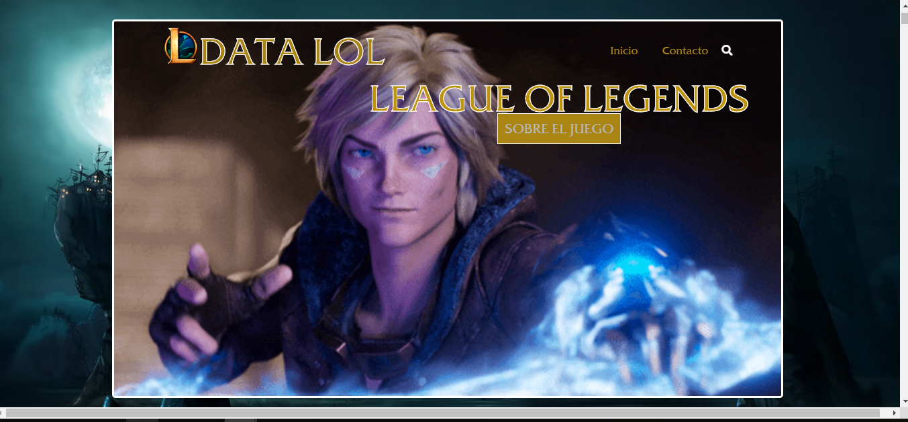
​
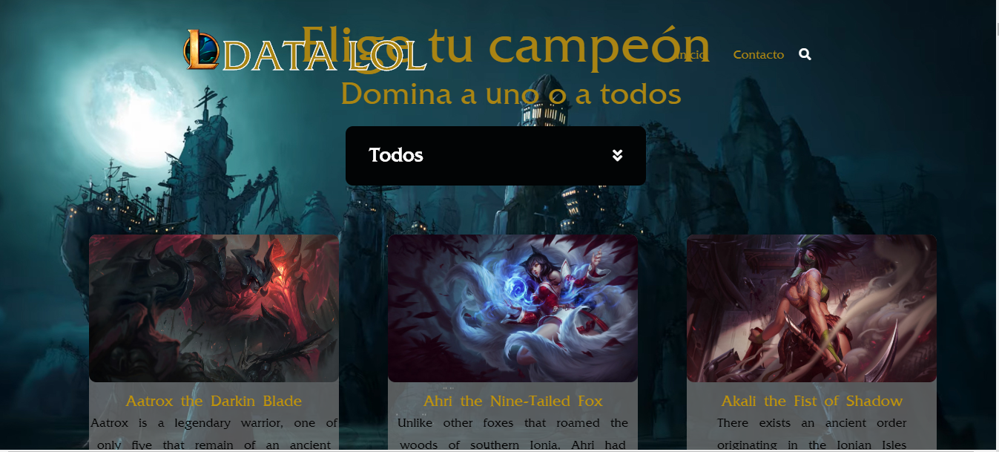
​
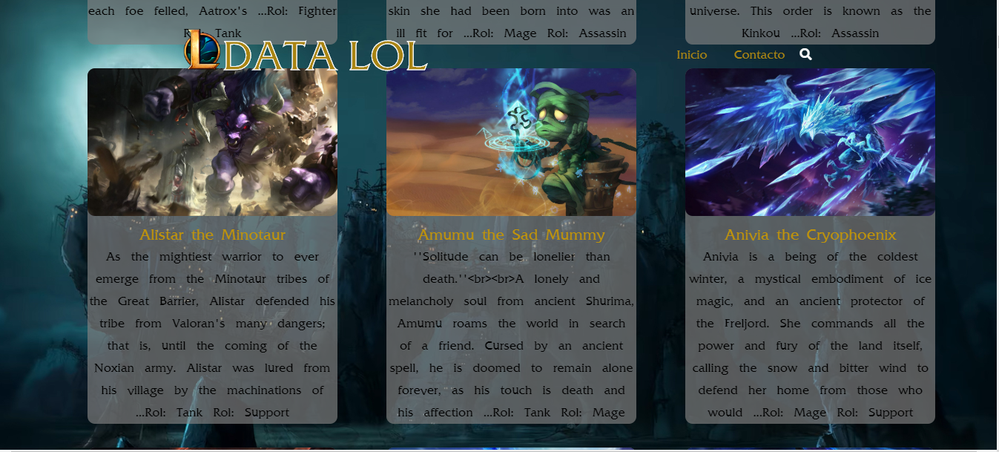
​
## 4. Look final del proyecto vista de móvil

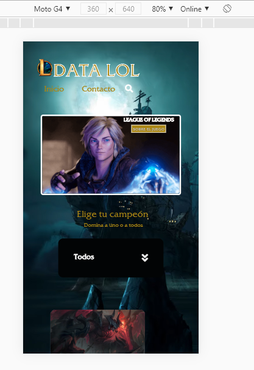

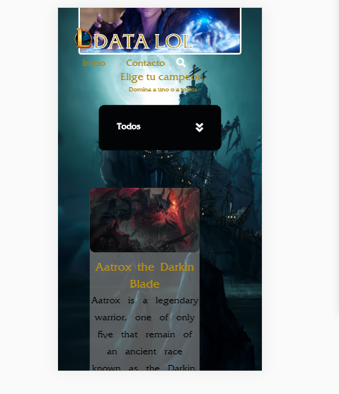

## 5. Investigación UX
​
### Sketch inicial
​
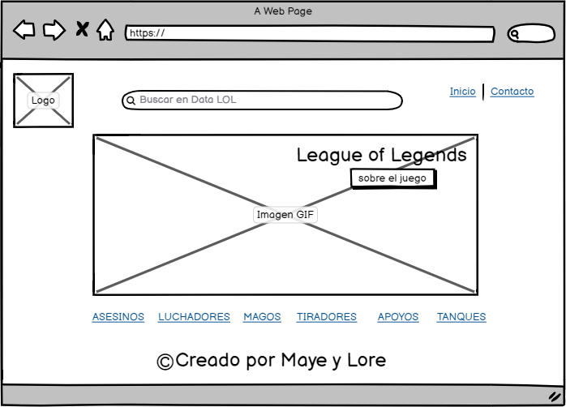
​

​
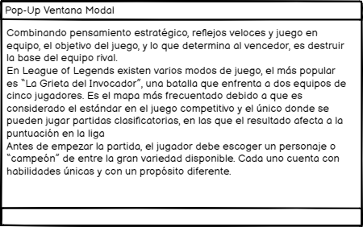

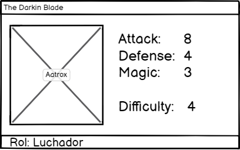

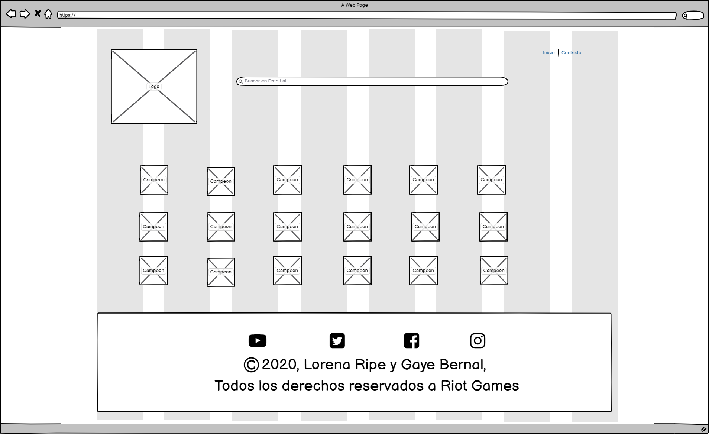

### Sketch inicial movil

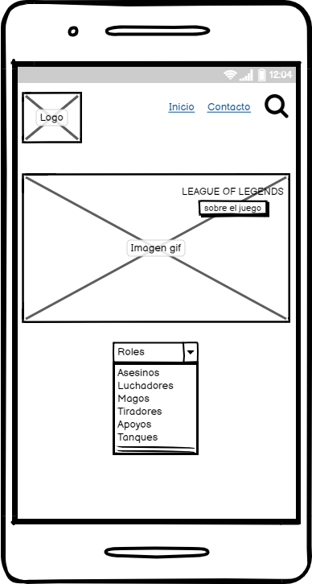

​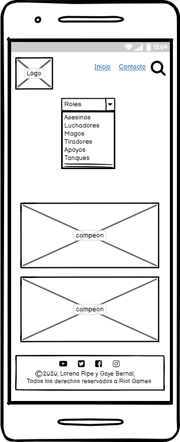

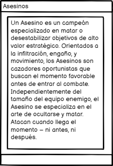

### Imagen del prototipo final
​
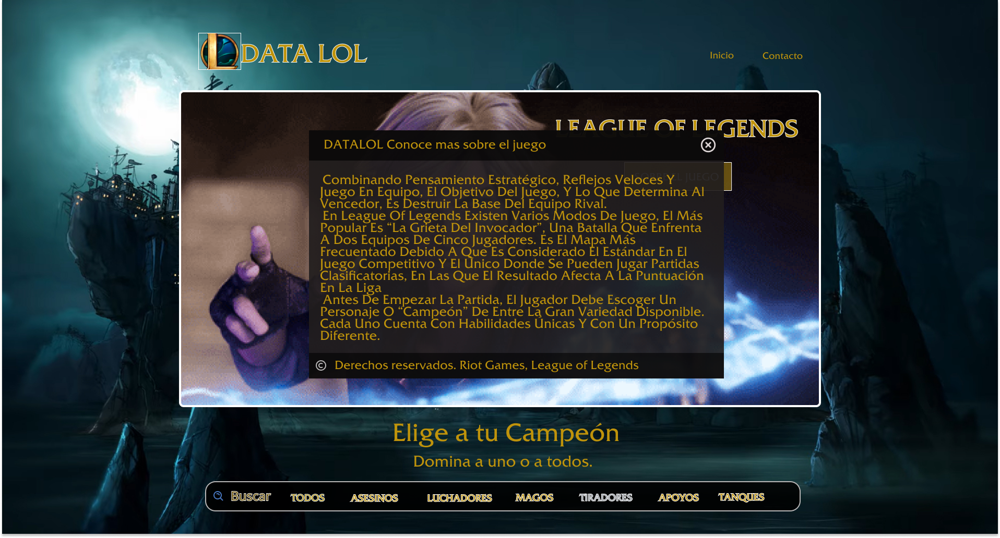

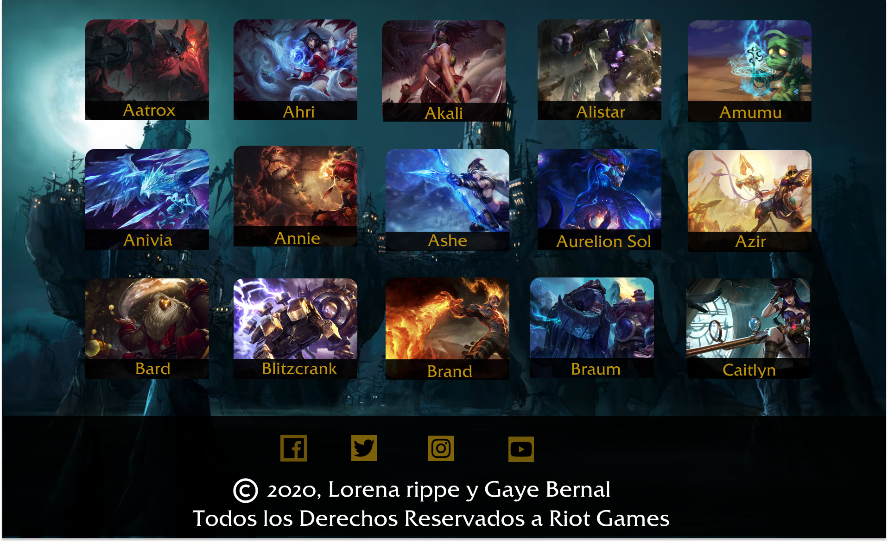
​
### Imagen del prototipo final mobile

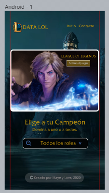

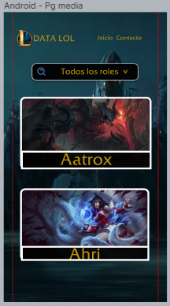

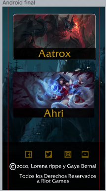
​
## 5. Planning del proyecto
​
Utilizamos [Trello] como herramienta de coordinación para el óptimo desarrollo del proyecto, para verlo da click [aquí](https://trello.com/b/rJaw2mXr/datalol).
​
## 6. Objetivos de aprendizaje
​
Trabajando en parejas aprenderán a construir una aplicación web que interactuará
con lx usuarix final a través del navegador, utilizando HTML, CSS y JavaScript
como tecnologías.
​
Reflexiona y luego marca los objetivos que has llegado a **entender** y
**aplicar** en tu proyecto.
​
### UX
​
* [x]  Diseñar la aplicación pensando y entendiendo al usuario
* [x]  Crear prototipos para obtener feedback e iterar
* [ ]  Aplicar los principios de diseño visual
* [x]  Planear y ejecutar tests de usabilidad.
​
### HTML y CSS
​
* [x]  Uso correcto de HTML semántico
* [x]  Uso de selectores de CSS
* [x]  Construir tu aplicación respetando el diseño realizado (maquetación).
* [x]  Uso de flexbox en CSS.
​
### DOM
​
* [x]  Uso de selectores del DOM
* [x]  Manejo de eventos del DOM
* [x]  Manipulación dinámica del DOM. (appendChild |createElement | createTextNode| innerHTML | textContent | etc.)
​
### Javascript
​
* [x] Uso de condicionales (if-else | switch | operador ternario)
* [x] Uso de bucles (for | for..in | for..of | while)
* [x] Uso de funciones (parámetros | argumentos | valor de retorno)
* [x] Manipular arrays (filter | map | sort | reduce)
* [x] Manipular objects (key | value)
* [x] Uso ES modules (import | export)
* [ ] Diferenciar entre expression y statements.
* [x] Diferenciar entre tipos de datos atómicos y estructurados.
​
### Testing
​
* [x] [Testeo Unitario]
​
### Estructura del código y guía de estilo
* [x] Organizar y dividir el código en módulos (Modularización)
* [x] Uso de identificadores descriptivos (Nomenclatura | Semántica)
* [ ] Uso de linter (ESLINT)
### Git y GitHub
​
* [x]  Comandos de git (`add` | `commit` | `pull` | `status` | `push`).
* [x]  Manejo de repositorios de GitHub (`clone` | `fork` | `gh-pages`).
* [x] Colaboración en Github (`branches` | `pull requests` | `tags`)
​
### Buenas prácticas de desarrollo,
​
* [x]  Organizar y dividir el código en módulos (Modularización).
* [x]  Uso de identificadores descriptivos (Nomenclatura | Semántica).
* [ ]  Uso de linter para seguir buenas prácticas (ESLINT).

### Historias de usuario

1. Hitoria de usuario :  Yo como interesado en jugar LoL quiero conocer de que se trata el juego.
2. Ver el historial de todos los campeones
3. Ver información de cada campeón en tarjetas
4. Filtrar campeones por roles para que el usuario lo encuentre mas dacilmente
5. Filtrar campeones por Nombres 

### Checklist

* [x] Usa VanillaJS.
* [x] No hace uso de this.
* [ ] Pasa linter (npm run pretest)
* [x] Pasa tests (npm test)
* [x] Pruebas unitarias cubren un mínimo del 70% de statements, functions y lines y branches.
* [x] Incluye Definición del producto clara e informativa en README.md.
* [x] Incluye historias de usuario en README.md.
* [x] Incluye sketch de la solución (prototipo de baja fidelidad) en README.md.
* [x] Incluye Diseño de la Interfaz de Usuario (prototipo de alta fidelidad) en README.md.
* [x] Incluye link a Zeplin o Figma en README.md.
* [x] Incluye el listado de problemas que detectaste a través de tests de usabilidad en el README.md.
* [x] UI: Muestra lista y/o tabla con datos y/o indicadores.
* [ ] UI: Permite ordenar data por uno o más campos (asc y desc).
* [x] UI: Permite filtrar data en base a una condición.
* [x] UI: Es responsive.
    